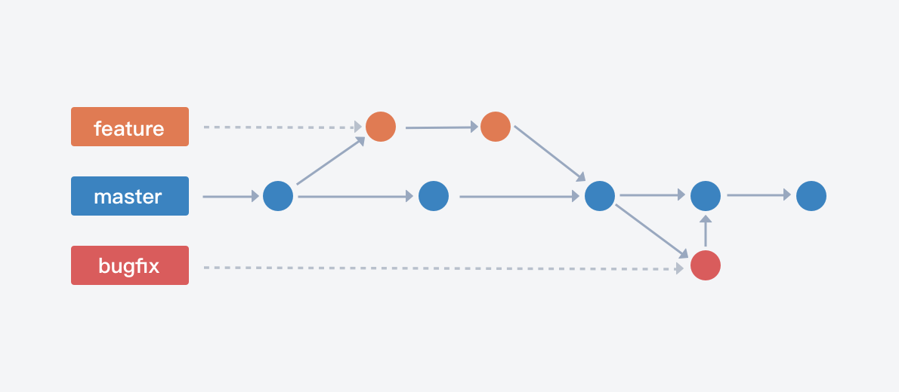

# Github Flow
> 基于分支、简单轻便的工作流，适用于代码部署频繁的团队和项目。

GitHub Flow 是一个非常轻便的，基于分支的工作流，非常适合代码部署非常频繁的团队和项目。它最大优点就是简单，对于"持续发布"的产品是最合适的流程。

它通过为功能开发、发布准备和项目维护分配独立的分支，让发布迭代过程更流畅。此模式通常是基于"版本发布"的，目标是一段时间以后产出一个新版本。

## 版本管理
默认开启版本管理。开启后，拉取的分支将归属于版本，包括分支关联的需求、缺陷等数据也将从该版本关联的维度去筛选过滤。

## 分支类型
1. 默认 master 为主干分支。
2. 自定义 2 种分支类型。
    - 开发分支，分支名 `dev/*`，跟随版本。
    - 修复分支，分支名 `bugfix/*`，跟随版本。

## 分支拉取与合入规则
1. 允许从 `所有类型` 拉取 `dev`，并自动同步源分支。
2. 允许从 `所有类型` 拉取 `bugfix`
3. 允许 `dev` 合并至 `dev` `master`
4. 允许 `bugfix` 合并至 `bugfix` `master`