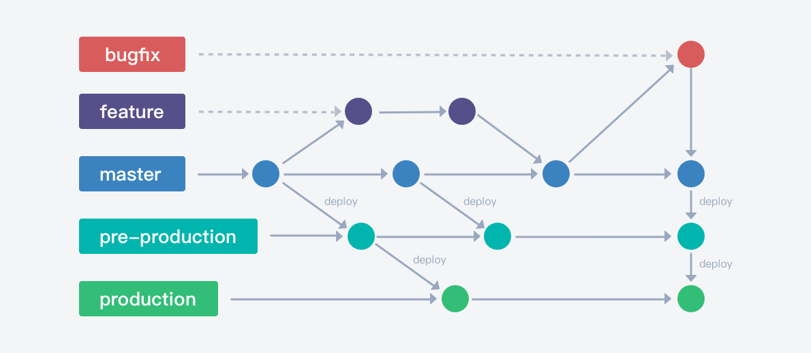

# Gitlab Flow 持续发布
> Git flow 与 Github flow 的综合，适用于持续发布的团队和项目。

GitLab Flow持续发布工作流一般适用于前端、后台持续/频繁发布的项目，关注最新版本，无需维护多个历史版本。

在该工作流中，存在一个主分支 master，作为集成分支，并存在pre-production、production分支分别对应预发布环境和生产环境。

GitLab Flow提倡"上游优先"（upstream first）原则，代码更新先提交到主分支master，再由"上游"向"下游"发展，逐步合入到pre-production和production。

## 版本管理
默认开启版本管理。开启后，拉取的分支将归属于版本，包括分支关联的需求、缺陷等数据也将从该版本关联的维度去筛选过滤。

## 分支类型
1. 默认 master 为主干分支。
2. 自定义 4 种分支类型。
    - 发布分支，分支名 `production/*`。
    - 预发布分支，分支名 `pre-production/*`。
    - bugfix分支，分支名 `bugfix/*`，跟随版本。
    - 开发分支，分支名 `dev/*`，跟随版本。

## 分支拉取与合入规则
1. 允许从所有类型拉取 `dev`，并自动同步源分支。
2. 允许从所有类型拉取 `bugfix`，并自动同步源分支。
3. 允许 `dev` 合并至 `dev` `master`
4. 允许 `master` 合并至 `pre-production`
5. 允许 `pre-production` 合并至 `production`
6. 允许 `bugfix` 合并至 `master` `dev` `pre-production` `production`