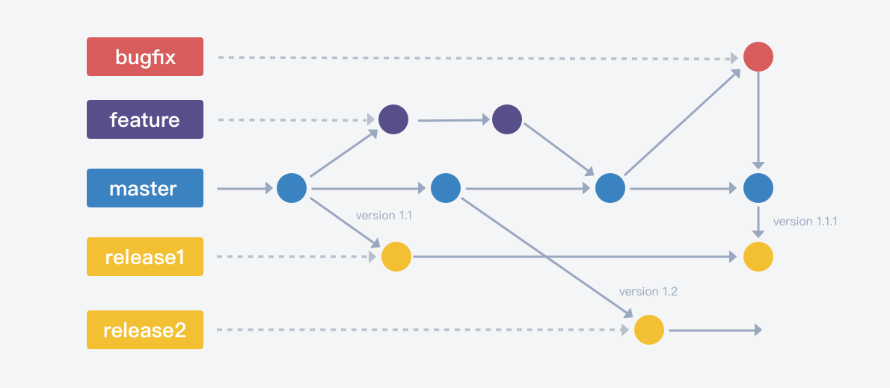

# Gitlab Flow 版本发布
> Git flow 与 Github flow 的综合，适用于按版本发布的团队和项目。

GitLab Flow版本发布工作流适用于有明确的版本规划、并且需要支持多个版本的项目，比如PC、终端类产品。

在该工作流中，存在一个主分支 master，作为集成分支，每一个发布版本将从master拉出一个发布分支。发布分支只做bugfix，不再合入需求特性。

GitLab Flow提倡"上游优先"（upstream first）的缺陷修复原则，即bugfix先提交到主分支master，再从master cherry-pick到目标发布分支。

## 版本管理
默认开启版本管理。开启后，拉取的分支将归属于版本，包括分支关联的需求、缺陷等数据也将从该版本关联的维度去筛选过滤。

## 分支类型
1. 默认 master 为主干分支。
2. 自定义 3 种分支类型。
    - 发布分支，分支名 `release/*`。
    - 开发分支，分支名 `dev/*`，跟随版本。
    - 修复分支，分支名 `bugfix/*`，跟随版本。

## 分支拉取与合入规则
1. 允许从所有类型拉取 `dev`，并自动同步源分支。
2. 允许从所有类型拉取 `release`，并自动同步源分支。
3. 允许从所有类型拉取 `bugfix`，并自动同步源分支。
4. 允许 `dev` 合并至 `dev` `master`
5. 允许 `release` 合并至 `release` `master`
6. 允许 `bugfix` 合并至 `master` `release` `bugfix`